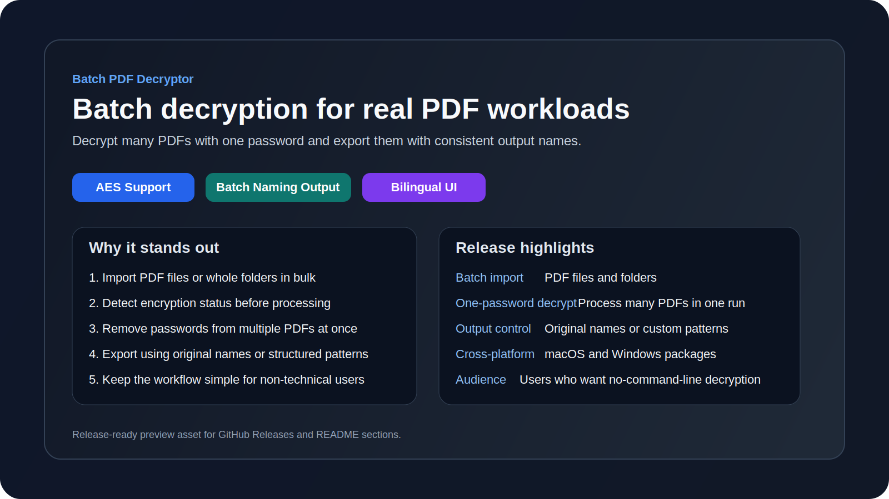
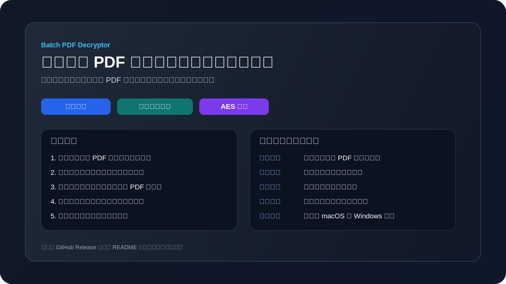

# Batch PDF Decryptor

[](https://github.com/Sevacenix/Batch_PDF_Decryptor/releases)
[](LICENSE)

A desktop utility for batch PDF decryption and batch output naming.

[中文说明](README.zh-CN.md)

## Download

[Download the latest macOS build](https://github.com/Sevacenix/Batch_PDF_Decryptor/releases/latest/download/PDF_Decryptor-macOS.zip)
[Download the SHA-256 checksum](https://github.com/Sevacenix/Batch_PDF_Decryptor/releases/latest/download/PDF_Decryptor-macOS.zip.sha256)
[Download the latest Windows build](https://github.com/Sevacenix/Batch_PDF_Decryptor/releases/latest/download/PDF_Decryptor-windows.zip)
[Download the Windows SHA-256 checksum](https://github.com/Sevacenix/Batch_PDF_Decryptor/releases/latest/download/PDF_Decryptor-windows.zip.sha256)

## Preview


## Release Preview

English:


中文：


## Features

- Batch import PDF files or scan a folder for PDFs
- Detect whether each file is encrypted
- Decrypt multiple files with one password
- AES-encrypted PDF support
- Save decrypted files to a selected folder
- Batch output naming with placeholder rules
- One-click original file name export
- Password visibility toggle
- Chinese and English UI support
- Focused on decryption and output naming, not PDF content editing

## Quick Start

```bash
python3 -m pip install -r requirements.txt
python3 app.py
```

## Build macOS App

```bash
brew install python@3.12 python-tk@3.12
./scripts/build_macos_app.sh
```

## Build Windows App

Use Windows PowerShell:

```powershell
py -3.12 -m pip install -r requirements.txt
./scripts/build_windows_app.ps1 -PythonExe "py -3.12" -AppVersion "1.0.5"
```

This generates:

- `dist/PDF_Decryptor-windows.zip`
- `dist/PDF_Decryptor-windows.zip.sha256`

## Install Notes

- macOS may ask you to confirm the app on first launch
- If that happens, right-click the app and choose `Open`
- Windows may show SmartScreen on first launch
- If that happens, choose `More info` and then `Run anyway`
- Each release also includes a `.sha256` checksum file for verification
- Windows packaging is prepared through `scripts/build_windows_app.ps1`
- GitHub Actions can build and upload both macOS and Windows release assets automatically

## Output Name Pattern

- `{name}`: original file name without extension
- `{index}`: file index with leading zeros, for example `001`
- `{date}`: current date in `YYYYMMDD`

If a file with the same name already exists in the output folder, the app appends `_1`, `_2`, and so on.

Suggested screenshots and release copy are prepared in [docs/GITHUB_RELEASE_COPY.md](docs/GITHUB_RELEASE_COPY.md).

## License

This project is licensed under the MIT License. See [LICENSE](LICENSE).
