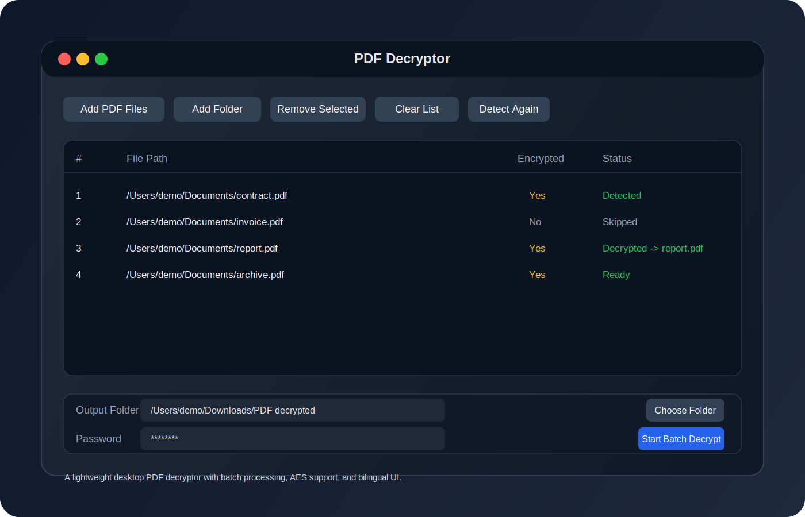

# PDF 解密器

[](https://github.com/Sevacenix/PDF_Decryptor/releases)
[](LICENSE)

一个轻量级桌面工具，用来批量检测 PDF 是否加密，并在输入密码后批量去除密码。

[English README](README.md)

## 下载

[下载最新 macOS 版本](https://github.com/Sevacenix/PDF_Decryptor/releases/latest/download/PDF_Decryptor-macOS.zip)

## 预览图



## 功能特性

- 支持批量导入 PDF 文件，也支持按文件夹扫描
- 自动检测每个 PDF 是否已加密
- 输入一次密码后批量解密多个文件
- 支持 AES 加密 PDF
- 输出到指定目录
- 支持自定义输出文件名格式
- 一键使用原文件名输出
- 支持显示或隐藏密码输入内容
- 支持中文和英文界面

## 快速开始

```bash
python3 -m pip install -r requirements.txt
python3 app.py
```

## 打包 macOS 应用

```bash
brew install python@3.12 python-tk@3.12
./scripts/build_macos_app.sh
```

## 文件名格式

- `{name}`：原文件名（不含扩展名）
- `{index}`：三位序号，例如 `001`
- `{date}`：当前日期，格式为 `YYYYMMDD`

如果输出目录中存在同名文件，程序会自动追加 `_1`、`_2` 避免覆盖。

## GitHub 发布建议

推荐上传的 Release 资产：

- `PDF_Decryptor-macOS.zip`

仓库描述、功能介绍和发布文案已整理在 [docs/GITHUB_RELEASE_COPY.md](docs/GITHUB_RELEASE_COPY.md)。

## 许可证

本项目采用 MIT License，详情见 [LICENSE](LICENSE)。
